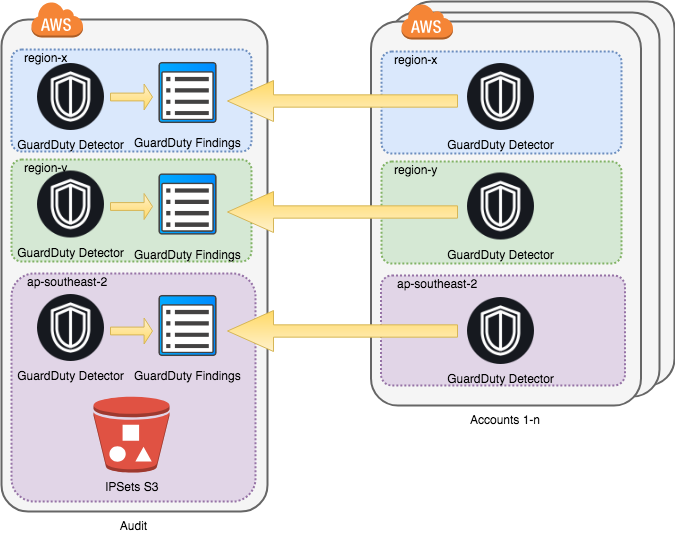

<!-- vim: set ft=markdown: -->


# terraform-aws-guardduty

#### Table of contents

1. [Overview](#overview)
2. [AWS GuardDuty - Overview Diagram](#aws-guardduty---overview-diagram)
3. [AWS GuardDuty Terraform](#aws-guardduty-terraform)
    * [Resources docs](#resources-docs)
    * [Inputs](#inputs)
    * [Outputs](#outputs)
    * [Examples](#examples)
        - [GuardDuty Master](#guardduty-master)
        - [GuardDuty Member](#guardduty-member)
4. [License](#license)

## Overview

Amazon GuardDuty is a continuous security monitoring service that analyses and processes the following data sources: VPC Flow Logs, AWS CloudTrail event logs, and DNS logs. It uses threat intelligence feeds, such as lists of malicious IPs and domains, and machine learning to identify unexpected and potentially unauthorised and malicious activity within your AWS environment.

This repo contains Terraform modules for configuring AWS GuardDuty and managing IPSets and ThreadSets used by GuardDuty.

Terraform >= 0.12.0 is required for this module.

## AWS GuardDuty - Overview Diagram



## AWS GuardDuty Terraform

### Resources docs

AWS GuardDuty automation includes use of the following core Terraform resources:

- [`aws_guardduty_detector`](https://www.terraform.io/docs/providers/aws/r/guardduty_detector.html) - A resource to manage a GuardDuty detector.
- [`aws_guardduty_invite_accepter`](https://www.terraform.io/docs/providers/aws/r/guardduty_invite_accepter.html) - A resource to accept a pending GuardDuty invite on creation, ensure the detector has the correct master account on read, and disassociate with the master account upon removal.
- [`aws_guardduty_ipset`](https://www.terraform.io/docs/providers/aws/r/guardduty_ipset.html) - IPSet is a list of trusted IP addresses.
- [`aws_guardduty_member`](https://www.terraform.io/docs/providers/aws/r/guardduty_member.html) - A resource to manage a GuardDuty member.
- [`aws_guardduty_threatintelset`](https://www.terraform.io/docs/providers/aws/r/guardduty_threatintelset.html) - ThreatIntelSet is a list of known malicious IP addresses.

### Inputs

The below outlines the current parameters and defaults.

| Name | Description | Type | Default | Required |
|------|-------------|:----:|:-------:|:--------:|
|is_guardduty_master|Whether the account is a master account|bool|false|No|
|is_guardduty_member|Whether the account is a member account|bool|false|No|
|detector_enable|Enable monitoring and feedback reporting|bool|true|No|
|has_ipset|Whether to include IPSet|bool|false|No|
|has_threatintelset|Whether to include ThreatIntelSet|bool|false|No|
|ipset_activate|Specifies whether GuardDuty is to start using the uploaded IPSet|bool|true|No|
|ipset_format|The format of the file that contains the IPSet|string|TXT|No|
|ipset_iplist|IPSet list of trusted IP addresses|list|[]|No|
|threatintelset_activate|Specifies whether GuardDuty is to start using the uploaded ThreatIntelSet|bool|true|No|
|threatintelset_format|The format of the file that contains the ThreatIntelSet|string|TXT|No|
|threatintelset_iplist|ThreatIntelSet list of known malicious IP addresses|list|[]|No|
|master_account_id|Account ID for Guard Duty Master. Required if is_guardduty_member|string|""|No|
|member_list|The list of member accounts to be added. Each member list need to have values of account_id, member_email and invite boolean|object|[]|No|

### Outputs

|Name|Description|
|------------|---------------------|
|detector_id|The ID of the GuardDuty detector|
|account_id|The AWS account ID of the GuardDuty detector|

### Examples

#### GuardDuty Master

A GuardDuty instance configured as a Master that invites a list of members:

```tf
variable "member_account_id" {}
variable "member_email" {}

module "guardduty" {
  source = "git@github.com:cmdlabs/terraform-aws-guardduty.git"

  detector_enable = true
  is_guardduty_master = true
  has_ipset = true
  has_threatintelset = true

  ipset_activate = true
  ipset_format = "TXT"
  ipset_iplist = [
    "1.1.1.1",
    "2.2.2.2",
  ]

  threatintelset_activate = true
  threatintelset_format = "TXT"
  threatintelset_iplist = [
    "3.3.3.3",
    "4.4.4.4",
  ]

  member_list = [{
    account_id   = var.member_account_id
    member_email = var.member_email
    invite       = true
  }]
}
```

To apply that:

```text
▶ TF_VAR_member_account_id=xxxxxxxxxxxx TF_VAR_member_email=alex@somedomain.com terraform apply
```

#### GuardDuty Member

Then a GuardDuty Member account can accept the invitation from the Master account using:

```tf
variable "master_account_id" {}

module "guardduty" {
  source = "git@github.com:cmdlabs/terraform-aws-guardduty.git"
  detector_enable = true
  is_guardduty_member = true
  master_account_id = var.master_account_id
}
```

To apply that:

```text
▶ TF_VAR_master_account_id=xxxxxxxxxxxx terraform apply
```

## License

Apache 2.0.
